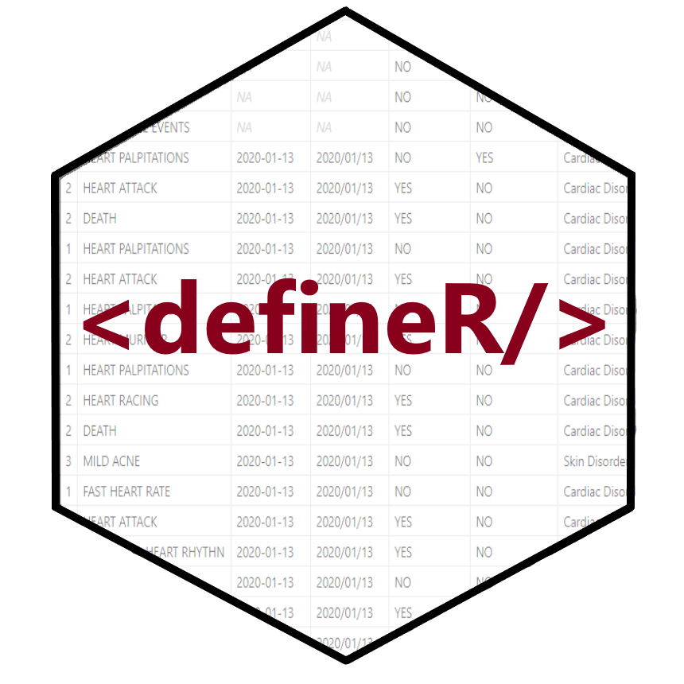

<!-- badges: start -->

<!-- badges: end -->

# Introduction to **defineR**

The **defineR** package is an open-source R language package to 
create define.xml documents that are suitable for submission 
to the U.S. Food and Drug Administration.  The package has the following
capabilities:

<tab>1. Create the define.xml document  
<tab>2. Perform consistency checks and schema validation of the define.xml  
<tab>3. Write and view a report of the consistency checks  
<tab>4. Produce the define.html transformation of define.xml  
<tab>5. Generate the metadata templates needed to create the define.xml  

Currently, the package only supports version 2.0.0 of the define.xml. 
Define version 2.0.0 is the version preferred by the FDA.  
Future enhancements to the package will add support for define version 2.1.

### Installation

The easiest way to install the **defineR** package is to run the following 
command from your R console:

    install.packages("defineR")

Then put the following line at the top of your script:

    library(defineR)
    
For examples and usage 
information, please visit the **defineR** documentation site 
[here](https://defineR.r-sassy.org/articles/defineR.html)

### Getting Help

If you need help, the first place 
to turn to is the [defineR](https://defineR.r-sassy.org) web site.  

If you want to look at the code for the **defineR** package, visit the
github page [here](https://github.com/dbosak01/defineR).

If you encounter a bug or have a feature request, please submit an issue 
[here](https://github.com/dbosak01/defineR/issues).

### See Also

The **defineR** package is associated with the **sassy** meta-package, 
and utilizes many of the packages from that system.
The **sassy** meta-package includes several packages that help make R
easier.  You can read more about the **sassy** packages
[here](https://sassy.r-sassy.org).
