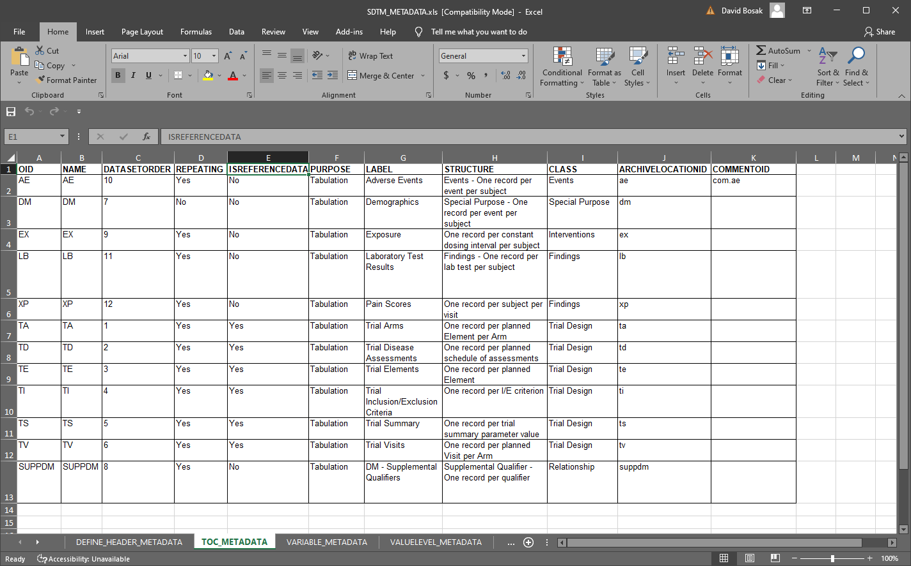
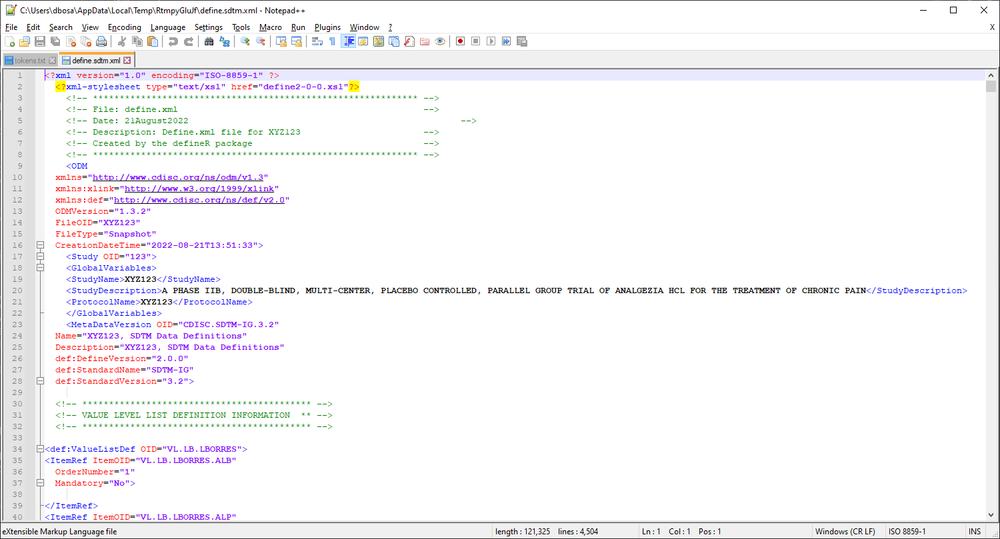
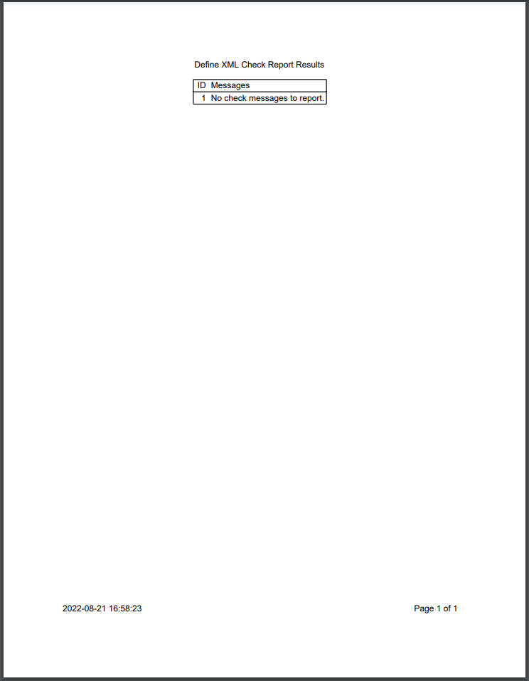
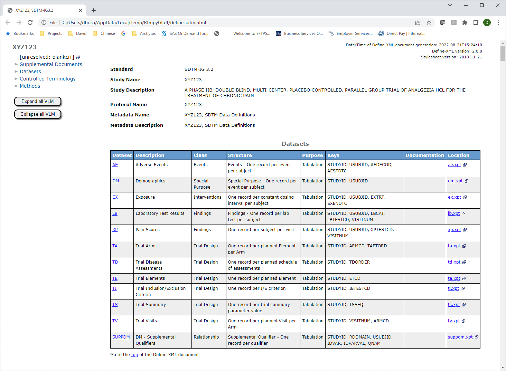
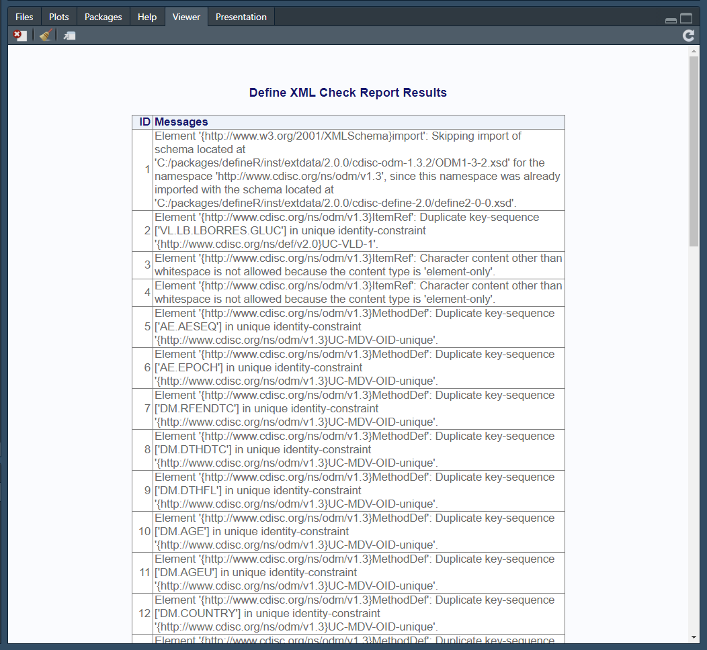
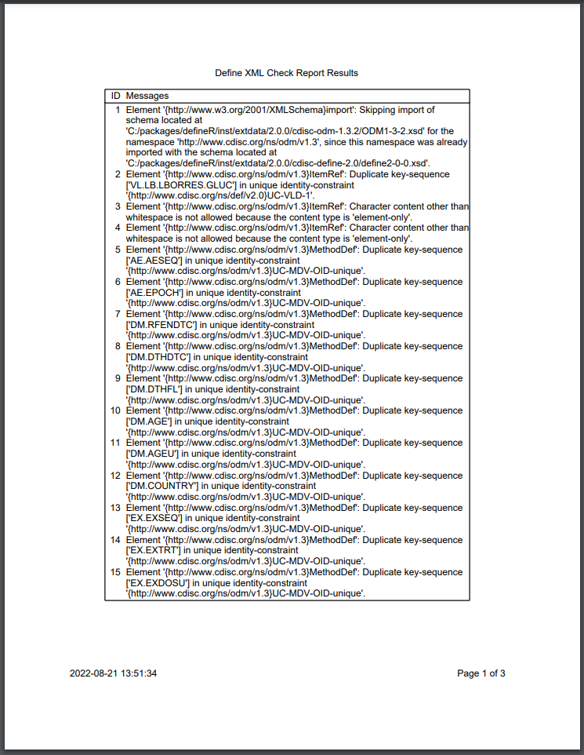

```{r, include = FALSE}
knitr::opts_chunk$set(
  collapse = TRUE,
  comment = "#>"
)
```

The **defineR** package creates the "define.xml" documents needed for 
regulatory submission to the FDA and other regulatory bodies.
The XML structure for the documents 
was defined by the [CDISC](https://www.cdisc.org/) standards organization, 
in collaboration 
with industry representatives.  The documents are required for FDA submission, 
and are frequently characterized as the "most important" documents.  These documents
are used by FDA reviewers to understand the data being submitted.

The **defineR** package contains only two functions:

<tab>1. **`write_define()`**: Creates the define XML from spreadsheet metadata.  
<tab>2. **`write_metadata()`**: Generates a metadata spreadsheet template.  

Below is a brief demonstration of the above two functions. See the function
documentation for additional details.

### How to Use

The **defineR** package uses spreadsheet metadata to create the define.xml
document. The structure of this metadata has been standardized by CDISC, and is
widely used in the industry. The functions in **defineR** both read and 
write this spreadsheet.  The package handles both SDTM and ADaM data 
standards.

You can generate a sample metadata spreadsheet using the following code:
```{r eval=FALSE, echo=TRUE} 
# Get temporary directory 
tmp <- tempdir()

# Create demo spreadsheet
pth <- write_metadata(tmp, demo = TRUE)

# View file
# file.show(pth)

```
The above code will produce sample metadata for SDTM that looks like this:



#### Create the Define.xml
Using the metadata from above, we can now create the define.xml and 
associated files.  More than one file can be generated by this
function, depending on the parameters selected.  By default, the 
function will create the define.xml, a PDF check report, and the define.html.

```{r eval=FALSE, echo=TRUE} 
# Generate define files
res <- write_define(pth, tmp, view = FALSE)

# View check results
res
# NULL

# View XML
# file.show(file.path(tmp, "define.sdtm.xml"))

# View check report
# file.show(file.path(tmp, "check.sdtm.pdf"))

# View HTML
# file.show(file.path(tmp, "define.sdtm.html"))

```

### Function Outputs

The output directory will now contain the define.xml.  Here is the 
top portion of the document:


Here is the check report:


The HTML transformation was also generated and placed in the 
output directory.  Here is a portion of the HTML:


The transformation uses the latest available XSLT transformation from CDISC.
The latest XSLT includes code to insert line feeds in the method/comment column.
These line feeds make the HTML more readable than in the past.

Reviewing the HTML can give you valuable feedback on the accuracy and completeness
of your metadata.  But even more feedback can be obtained from the check report.

### Check Report

The SDTM demo metadata produces no completeness check messages.  When there
are messages, they will be communicated in three ways: 

1. The messages
will be contained in a vector returned by the function  
2. They will be displayed in the viewer  
3. They will be written to a PDF report in the output directory  

Here is what the viewer looks like when there are completeness messages:


The same check report is also output to the target directory as a PDF:


These check results can help you identify problems with your metadata.
You can use this function to iteratively check and correct your metadata
until no issues are found.


### Next Steps

For next steps, please review the function reference documentation:

* `write_define()`
* `write_metadata()`

